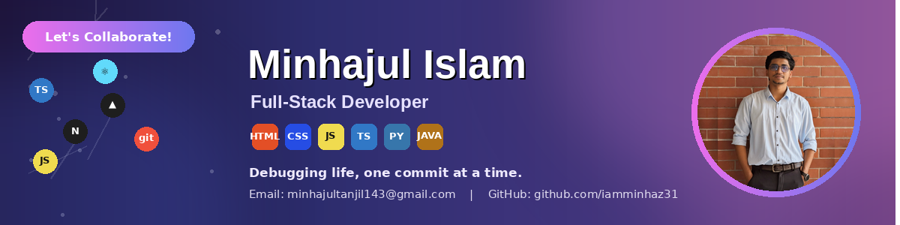

# 👋 Hi, I'm Minhajul Islam Tanjil (Minu)
### Full-Stack Developer & ML Enthusiast

---

## 🧑‍💻 About Me

CSE graduate building toward full-stack web development and machine learning, currently strengthening my foundations through **Programming Hero's** web development track. I like turning fundamentals — semantic HTML, clean JS, solid Git workflows — into real, working projects before moving up the stack.

| 📍 Location | 🎓 Background | 🎯 Current Focus | 📚 Currently Learning |
|:---:|:---:|:---:|:---:|
| Bangladesh | CSE Graduate | Full-Stack Dev + ML | Web Dev @ Programming Hero |

---

## 🛠️ Tech Stack & Tooling

**Frontend**

**Backend & Databases**

**Machine Learning**

**Workflow & Tools**

---

## 📈 Learning Progression

| Domain | Focus Areas | Progress |
|---|---|:---:|
| Web Fundamentals & UI | Semantic HTML5, CSS3, Responsive Design, Flexbox/Grid | ▓▓▓▓▓▓▓▓░░ 80% |
| JavaScript & DOM | ES6+ Syntax, Scopes, Closures, Array Methods | ▓▓▓▓▓▓▓░░░ 70% |
| Git & GitHub | Version Control, Branching, Collaboration Workflow | ▓▓▓▓▓▓▓▓░░ 80% |
| React & SPA Ecosystem | Components, Hooks, React Router | ▓▓▓▓░░░░░░ 40% |
| Backend & REST APIs | Node.js, Express.js, Routing, Middleware | ▓▓▓░░░░░░░ 30% |
| Machine Learning Foundations | Python, Data Analysis, Core ML Concepts | ▓▓▓░░░░░░░ 30% |

---

## 📌 Featured Repositories

| Repository | Description | Stack |
|---|---|---|
| [minhaz-portfolio](https://github.com/iamminhaz31/minhaz-portfolio) | My Updated Portfolio | CSS |
| [ph-first-assignment-minhaz](https://github.com/iamminhaz31/ph-first-assignment-minhaz) | My first assignment for Programming Hero course | CSS |

---

## 📊 GitHub Analytics

---

## 🤝 Connect with Me

